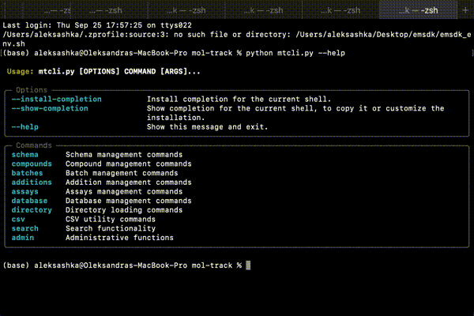

# MolTrack

[](https://pypi.org/project/dg-mol-track/) [](./LICENSE)

A lightweight, flexible, and extendable FastAPI server for managing chemical compounds, batches, and properties, powered by RDKit-enabled Postgres for chemical intelligence. Ideal for labs, startups, and small- to medium-sized biotech companies.

**MolTrack is:**

* **Open-source**: Fully accessible code under the MIT license
* **Easy to use**: CLI and REST APIs for seamless workflow integration
* **Chemically intelligent**: Supports structure-aware queries
* **Hackable**: Simple to extend, customize, and integrate proprietary logic
* **Enterprise-ready**: Scales reliably for production environments
* **Fast**: Optimized for high performance

See also: [User stories](./docs/user-stories.md) • [Features](./docs/features.md) • [Developer guide](./CONTRIBUTING.md)

## Table of Contents

- [Usage](#usage)
- [Integration with Datagrok](#integration-with-datagrok)
- [Features](#features)

## Usage

### CLI tool

MolTrack provides a command-line interface for managing compounds, batches and assay data directly from your terminal. Currently, the CLI can be run from the MolTrack root folder using:
<!-- We should publish the CLI tool to PyPI, as it is currently only available via endpoints in dg-mol-track. This is just a placeholder for the official version. -->

```bash
python mtcli.py <command> [options]
```

To see the full list of available commands and usage examples, refer to the [CLI usage guide](./client/client.md).

<!-- This is the placeholder for the gif. -->


### Web server

MolTrack can be run locally as a web server using the automated setup scripts:

* `setup.sh` — for **macOS/Linux**
* `setup.bat` — for **Windows**

<br>

These scripts handle all setup steps automatically, including building the Docker image, running the container, creating a Python virtual environment, and syncing dependencies. They can also optionally start the server.

> **Note:** Docker must be installed and running before using these scripts.

**macOS/Linux**

```bash
chmod +x setup.sh
./setup.sh           # Run setup only
./setup.sh --run_server  # Run setup and start the server
```

**Windows**

```cmd
setup.bat            # Run setup only
setup.bat --run_server  # Run setup and start the server
```

The setup typically takes **2–3 minutes**. Once ready, open [http://localhost:8000/docs](http://localhost:8000/docs) to access the API documentation.

## Integration with Datagrok

To make MolTrack truly accessible, we aim to provide chemists with an intuitive UI, without requiring them to run Docker containers or use the CLI.

To achieve this, we have developed an MIT-licensed [Datagrok MolTrack plugin](https://github.com/datagrok-ai/public/tree/master/packages/MolTrack/README.md). The plugin allows users to interact with MolTrack directly within the Datagrok platform, providing features such as:

* Compound, batch, and assay data registration
* Powerful structure-based search
* Effortless integration with Datagrok analysis and visualization tools

> **Note:** While both MolTrack and the MolTrack plugin are open-source, the Datagrok platform itself is proprietary. It is free for personal use, academia, and non-profit research. Claim your license [here](https://datagrok.ai).


## Features

Core MolTrack capabilities:

* Registration of compounds, batches, and assay data  
* Metadata and property management  
* Structure-based and metadata search  
* Audit trails and role-based access control  
* RESTful API for integration with external systems  

➡️ Explore the full roadmap: [Features & Roadmap](./docs/features.md)  
➡️ Detailed API documentation: [API Reference](./docs/api.md)